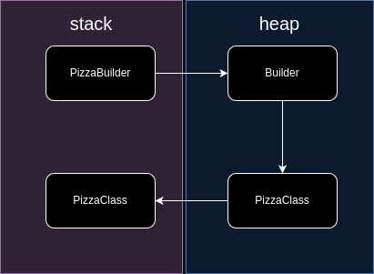

Aluno: Eduardo Pires Carvalho

> 
Após a implementação, explique porque o objeto builder, destacado no exemplo acima, precisou seu instanciado
> duas vezes. Contemple na explicação como é o comportamento em memória dos objetos Pizza.Builder e Pizza.

O builder é instanciado múltiplas vezes, pois cada instância de builder pode ser definida como um novo construtor para a classe Pizza. Seu comportamento em memória segue este raciocínio, onde a Pizza só é instanciada pelo próprio builder e retornada para a memória heap.Seguindo o fluxo abaixo:

